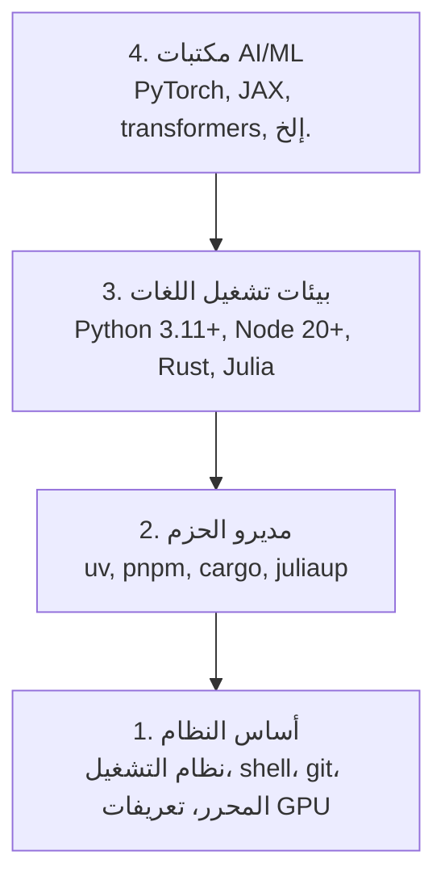

# بيئة التطوير (Dev Environment)

> **English Title:** Dev Environment — Your tools shape your thinking. Set them up once, set them up right.

---

## 1. ما الذي سنتعلمه؟

في هذا الدرس ستتعلم كيف تبني بيئة تطوير احترافية كاملة لمسار **هندسة الذكاء الاصطناعي (AI Engineering)**، تشمل:

- تثبيت **Python 3.11+** و**Node.js 20+** و**Rust** من الصفر.
- إعداد **البيئات الافتراضية (Virtual Environments)** ومديري الحزم (Package Managers) لضمان إعادة إنتاج النتائج.
- التحقق من وصول **GPU** عبر **CUDA** أو **MPS** وتشغيل أول عملية على المصفوفات (Tensor Operation).
- فهم **المكدس الرباعي الطبقات (Four-Layer Stack)**: النظام، الحزم، بيئات التشغيل، مكتبات الذكاء الاصطناعي.

---

## 2. لماذا هذا الموضوع مهم؟

### المشكلة الحقيقية

تخيّل أنك تحاول تعلّم 500+ درس في هندسة الذكاء الاصطناعي باستخدام Python وTypeScript وRust وJulia، وفي اليوم الأول يظهر لك هذا الخطأ:

```text
ModuleNotFoundError: No module named 'numpy'
```

أو هذا:

```text
error[E0433]: failed to resolve: use of undeclared crate or module
```

معظم الناس يتجاهلون إعداد البيئة، فيقضون ساعات طويلة في **تصحيح أخطاء الأدوات** بدلاً من تصحيح أخطاء الكود. هذا يُضيع الوقت ويُفقد الحماس.

**الحل:** نُعِد البيئة مرة واحدة، وبشكل صحيح.

### لماذا تحتاج إلى بيئة متكاملة؟

في هندسة الذكاء الاصطناعي تتعامل مع:

| اللغة | الاستخدام | الإصدار المطلوب |
|-------|-----------|-----------------|
| Python | المراحل 1-12 (ML، DL، NLP، Vision، Audio، LLMs) | 3.11+ |
| TypeScript | المراحل 13-17 (Tools، Agents، Swarms، Infra) | Node.js 20+ |
| Rust | المراحل 12، 15-17 (الأنظمة عالية الأداء) | أحدث إصدار |
| Julia | المرحلة 1 (الأسس الرياضية) | أحدث إصدار |

كل لغة تعتمد على أدواتها الخاصة، وكل أداة تعتمد على الطبقة التي تحتها.

---

## 3. المتطلبات السابقة

**لا يوجد متطلبات مسبقة** لهذا الدرس. هذا هو الدرس الأول في المنهج.

ما تحتاجه فعلاً:
- جهاز كمبيوتر يعمل بنظام Linux أو macOS أو Windows مع WSL2.
- اتصال بالإنترنت لتنزيل الأدوات.
- **رغبة في التعلم** — هذا كافٍ.

---

## 4. الفكرة الأساسية — Intuition

### تشبيه: طبقات البناء

فكّر في بيئة التطوير كـ **مبنى** يُبنى من الأسفل للأعلى:

- **الطابق الأرضي (الأساس):** نظام التشغيل، المحرر، Git، تعريفات GPU.
- **الطابق الأول:** مديرو الحزم مثل `uv` و`pnpm` و`cargo`.
- **الطابق الثاني:** بيئات تشغيل اللغات مثل Python وNode.js.
- **الطابق الثالث (القمة):** مكتبات الذكاء الاصطناعي مثل PyTorch وTransformers.

**القاعدة الذهبية:** كل طبقة تعتمد على الطبقة التي تحتها. لا يمكنك تثبيت PyTorch إذا لم يكن Python موجوداً. لا يمكنك استخدام Python بشكل موثوق إذا لم تكن مديرات الحزم مثبتة بشكل صحيح.

---

## 5. المفاهيم الأساسية

### 5.1 المكدس الرباعي الطبقات (Four-Layer Stack)



**لماذا نبدأ من الأسفل؟**

لأن كل طبقة تعتمد على ما تحتها:
- مكتبة `torch` (Layer 4) تحتاج `pip` أو `uv` (Layer 2) لتثبيتها.
- `uv` (Layer 2) تحتاج Python نفسه (Layer 3) ليعمل.
- Python (Layer 3) يحتاج نظام التشغيل والمكتبات الأساسية (Layer 1).

### 5.2 البيئة الافتراضية (Virtual Environment)

**ما هي؟**

البيئة الافتراضية هي **مجلد عزل** يحتوي على نسخة مستقلة من Python ومكتباتها. يمكنك أن يكون لديك:

```text
مشروع_A/
    .venv/         ← Python 3.11 + PyTorch 2.0
مشروع_B/
    .venv/         ← Python 3.12 + PyTorch 2.3
```

الاثنان يعملان بشكل مستقل دون تعارض.

**لماذا نحتاجها؟**

بدون بيئة افتراضية:
- تُثبَّت جميع الحزم على مستوى النظام كله.
- ترقية `PyTorch` لمشروع واحد قد **تكسر** مشروعاً آخر يعتمد على نسخة قديمة.
- لا يمكن إعادة إنتاج البيئة على جهاز آخر بدقة.

**مع بيئة افتراضية:**

```bash
# كل مشروع معزول تماماً
source project_A/.venv/bin/activate
python -c "import torch; print(torch.__version__)"  # 2.0.0

source project_B/.venv/bin/activate
python -c "import torch; print(torch.__version__)"  # 2.3.1
```

### 5.3 CUDA وتسريع GPU

**ما هو CUDA؟**

CUDA (**Compute Unified Device Architecture**) هو نظام الحوسبة المتوازية من شركة NVIDIA. يسمح لك بتشغيل عمليات رياضية على آلاف أنوية GPU في وقت واحد.

**لماذا هذا مهم في AI؟**

في الذكاء الاصطناعي، معظم الحسابات هي عمليات **ضرب مصفوفات (Matrix Multiplication)**:

```text
مثال بسيط:
A (1000 × 1000)  ×  B (1000 × 1000)  =  C (1000 × 1000)
```

هذه العملية تتطلب **10^9** (مليار) عملية ضرب وجمع.

| الجهاز | الوقت التقريبي |
|--------|----------------|
| CPU (8 أنوية) | عدة ثوانٍ |
| GPU (آلاف الأنوية) | أجزاء من الثانية |

لذلك GPU يُعطي تسريعاً هائلاً لتدريب نماذج الذكاء الاصطناعي.

**ماذا إذا لم يكن لديّ GPU؟**

لا توجد مشكلة! معظم دروس هذا المنهج تعمل على **CPU**. GPU يصبح ضرورياً فقط في دروس **التدريب المكثف (Training-Heavy Lessons)**.

### 5.4 مديرو الحزم (Package Managers)

| الأداة | اللغة | الوظيفة |
|--------|-------|---------|
| `uv` | Python | تثبيت حزم Python بسرعة 10-100× مقارنة بـ pip |
| `pnpm` | TypeScript/JS | تثبيت حزم Node.js بكفاءة |
| `cargo` | Rust | بناء وتثبيت حزم Rust |
| `juliaup` | Julia | إدارة إصدارات Julia |

---

## 6. الرياضيات بالتفصيل

هذا الدرس هو درس **إعداد (Setup)**، لذلك لا يحتوي على معادلات رياضية. لكن من المهم فهم لماذا نثبت هذه الأدوات:

### لماذا نحتاج NumPy؟

NumPy هي مكتبة Python للحسابات العددية. تعتمد على **مصفوفات N-أبعاد (N-dimensional Arrays)**:

```python
import numpy as np

# متجه (Vector) — مصفوفة 1D
a = np.array([1, 2, 3])
print(a.shape)  # (3,) — ثلاثة عناصر

# حساب الضرب النقطي (Dot Product)
dot_product = np.dot(a, a)  # 1² + 2² + 3² = 14
print(dot_product)  # 14
```

هذه العملية البسيطة هي أساس كل شيء في الذكاء الاصطناعي — من Linear Regression إلى Transformers.

### لماذا نحتاج PyTorch؟

PyTorch تضيف فوق NumPy شيئاً جوهرياً: **التفاضل التلقائي (Automatic Differentiation)**، وهو الذي يجعل تدريب الشبكات العصبية ممكناً. سنشرح هذا بالتفصيل في المراحل القادمة.

---

## 7. الخوارزمية — خطوات الإعداد

الإعداد يتبع ترتيباً محدداً من الأسفل للأعلى:

```text
الخطوة 1: أساس النظام (Git، أدوات البناء)
      ↓
الخطوة 2: Python مع uv
      ↓
الخطوة 3: Node.js مع pnpm
      ↓
الخطوة 4: Rust
      ↓
الخطوة 5: Julia (اختياري)
      ↓
الخطوة 6: GPU Setup (اختياري)
      ↓
الخطوة 7: التحقق من الإعداد
```

---

## 8. التطبيق العملي — الإعداد خطوة بخطوة

### الخطوة 1: أساس النظام

أول شيء نثبته هو أدوات البناء الأساسية.

**على macOS:**

```bash
xcode-select --install
brew install git curl wget
```

- `xcode-select --install`: يثبت أدوات سطر أوامر Apple (Clang compiler، Make، إلخ).
- `brew install git curl wget`: يثبت Git لإدارة الكود، و`curl`/`wget` لتنزيل الملفات.

**على Ubuntu/Debian:**

```bash
sudo apt update && sudo apt install -y build-essential git curl wget unzip
```

- `build-essential`: حزمة تشمل GCC compiler و Make وأدوات البناء.
- `unzip`: مطلوب لبعض المثبّتات مثل fnm.
- `-y`: موافقة تلقائية (no prompts).

**على Windows:**

```bash
wsl --install -d Ubuntu-24.04
```

يثبت **WSL2 (Windows Subsystem for Linux)** — يعطيك بيئة Linux حقيقية داخل Windows. جميع الأوامر التالية ستعمل داخل WSL2.

---

### الخطوة 2: Python مع uv

#### لماذا uv وليس pip؟

`pip` هو مثبّت Python التقليدي. لكنه **بطيء** في حل التعارضات بين الإصدارات.

`uv` مكتوب بـ Rust وأسرع بـ 10-100× من pip. يتعامل مع:
- تثبيت Python نفسه.
- إنشاء البيئات الافتراضية.
- تثبيت الحزم بسرعة فائقة.

```bash
# تثبيت uv
curl -LsSf https://astral.sh/uv/install.sh | sh

# تثبيت Python 3.12
uv python install 3.12

# إنشاء بيئة افتراضية في المجلد الحالي
uv venv

# تفعيل البيئة الافتراضية
source .venv/bin/activate          # Linux/macOS
# أو:
.venv\Scripts\activate             # Windows

# تثبيت المكتبات الأساسية
uv pip install numpy matplotlib jupyter
```

**ماذا تعني هذه الأوامر؟**

| الأمر | المعنى |
|-------|--------|
| `curl -LsSf https://astral.sh/uv/install.sh \| sh` | تنزيل وتشغيل سكريبت تثبيت uv |
| `uv python install 3.12` | تثبيت Python 3.12 عبر uv |
| `uv venv` | إنشاء مجلد `.venv/` يحتوي بيئة افتراضية معزولة |
| `source .venv/bin/activate` | تفعيل البيئة (يجعل `python` يشير إلى النسخة في `.venv`) |
| `uv pip install numpy matplotlib jupyter` | تثبيت ثلاث مكتبات أساسية |

#### التحقق من Python:

```python
import sys
print(f"Python {sys.version}")

import numpy as np
print(f"NumPy {np.__version__}")
a = np.array([1, 2, 3])
print(f"Vector: {a}, dot product with itself: {np.dot(a, a)}")
```

**ماذا يحدث هنا؟**

- `np.array([1, 2, 3])`: ينشئ متجهاً (Vector) بثلاثة عناصر.
- `np.dot(a, a)`: يحسب الضرب النقطي للمتجه مع نفسه.

الضرب النقطي:

$$
a \cdot a = 1^2 + 2^2 + 3^2 = 1 + 4 + 9 = 14
$$

هذا يعني أن NumPy مثبّتة وتعمل بشكل صحيح.

---

### الخطوة 3: Node.js مع pnpm

Node.js تحتاجه لدروس **TypeScript** (Agents، MCP Servers، Web Apps).

```bash
# تثبيت fnm (Fast Node Manager)
curl -fsSL https://fnm.vercel.app/install | bash

# تثبيت Node.js 22
fnm install 22
fnm use 22

# تثبيت pnpm (مدير حزم أسرع من npm)
npm install -g pnpm

# التحقق
node -e "console.log('Node', process.version)"
```

**ملاحظة مهمة:** `fnm` يحتاج `unzip` على Linux. إذا لم يكن مثبتاً، ثبّته أولاً:
```bash
sudo apt install -y unzip
```

**على macOS / Apple Silicon (M1/M2/M3/M4):**
إذا ظهر خطأ Rosetta 2:
```bash
arch -arm64 brew install fnm
echo 'eval "$(fnm env --use-on-cd)"' >> ~/.zshrc
source ~/.zshrc
```

---

### الخطوة 4: Rust

Rust مطلوب للدروس التي تتعامل مع **الأنظمة عالية الأداء** (inference engine، أدوات النظام).

```bash
# تثبيت Rust عبر rustup
curl --proto '=https' --tlsv1.2 -sSf https://sh.rustup.rs | sh

# التحقق
rustc --version
cargo --version
```

`rustup` هو مدير إصدارات Rust — يُثبّت المترجم (`rustc`) ومدير الحزم والبناء (`cargo`).

---

### الخطوة 5: Julia (اختياري)

Julia لغة سريعة جداً للحسابات الرياضية. تستخدمها في دروس الأسس الرياضية (المرحلة 1).

```bash
curl -fsSL https://install.julialang.org | sh

julia -e 'println("Julia ", VERSION)'
```

---

### الخطوة 6: إعداد GPU

**NVIDIA (Linux / Windows):**

```bash
# التحقق من وجود GPU
nvidia-smi

# تثبيت PyTorch مع CUDA
uv pip install torch torchvision torchaudio --index-url https://download.pytorch.org/whl/cu124
```

**macOS / Apple Silicon:**

على Mac لا يوجد CUDA (هذا طبيعي!). PyTorch يستخدم **MPS (Metal Performance Shaders)** بدلاً منه:

```bash
uv pip install torch torchvision torchaudio
```

> ⚠️ **تحذير:** لا تُضف `--index-url .../cuXXX` على Mac — تلك wheels مخصصة لـ Linux/Windows فقط وستفشل.

**التحقق من GPU (يعمل على جميع المنصات):**

```python
import torch
print(f"CUDA available: {torch.cuda.is_available()}")           # False على macOS — طبيعي
print(f"MPS available:  {torch.backends.mps.is_available()}")   # True على Apple Silicon
if torch.cuda.is_available():
    print(f"GPU: {torch.cuda.get_device_name(0)}")
```

---

### الخطوة 7: التحقق الشامل من البيئة

الأهم من بين جميع الخطوات — التحقق من أن كل شيء يعمل:

```bash
# للمبتدئين:
python3 phases/00-setup-and-tooling/01-dev-environment/code/verify.py --route beginner

# لمسارات أخرى:
python3 phases/00-setup-and-tooling/01-dev-environment/code/verify.py --route ml-foundations
python3 phases/00-setup-and-tooling/01-dev-environment/code/verify.py --route llm-engineering
python3 phases/00-setup-and-tooling/01-dev-environment/code/verify.py --route agents
python3 phases/00-setup-and-tooling/01-dev-environment/code/verify.py --route mcp
```

**أين تشغّل هذا الأمر؟**
من **جذر المستودع (Repository Root)** — المجلد الذي يحتوي على `README.md` و`phases/`.

**ما الذي يحدث عند تشغيله؟**

البرنامج يفحص الأدوات المطلوبة للمسار المختار فقط ويعرض النتيجة:

```text
=== AI Engineering from Scratch: Environment Check ===

Route: Beginner course (`--route beginner`)

  [PASS] Python 3.11+   (required now)
         Python 3.12.0 at /home/user/.venv/bin/python3
  [PASS] Git            (required now)
         git version 2.43.0 at /usr/bin/git

Later checks skipped: 9 tools are not needed to start. Add `--show-later` when you want to inspect them.

Result: 2/2 required checks passed
Ready to start Beginner course.
Next: python3 phases/01-math-foundations/01-linear-algebra-intuition/code/vectors.py
```

**ماذا يعني كل سطر؟**

- `[PASS]`: الأداة موجودة وتعمل بالإصدار المطلوب.
- `[FAIL]`: الأداة مفقودة أو إصدارها قديم.
- `[LATER]`: الأداة غير مطلوبة الآن لكنها ستُحتاج لاحقاً.

**إضافة `--show-later`:** لفحص الأدوات الاختيارية أيضاً:

```bash
python3 phases/00-setup-and-tooling/01-dev-environment/code/verify.py --route beginner --show-later
```

---

## 9. شرح الكود الأصلي بالتفصيل

### `verify.py` — سكريبت التحقق من Python

هذا السكريبت هو قلب الدرس. لنفهمه سطراً بسطر.

#### الهياكل البيانية (Data Structures)

```python
@dataclass(frozen=True)
class Result:
    ok: bool
    detail: str
```

**ما هذا؟**

`Result` هو **نتيجة فحص واحدة**:
- `ok: bool` — هل نجح الفحص؟ (`True`/`False`)
- `detail: str` — تفاصيل النتيجة (مثل "Python 3.12.0 at /usr/bin/python3")

`@dataclass(frozen=True)`:
- `@dataclass`: يولّد تلقائياً `__init__`, `__repr__`, `__eq__` بدل كتابتها يدوياً.
- `frozen=True`: يجعل الكائن **غير قابل للتعديل (Immutable)** بعد إنشائه — ممارسة جيدة للبيانات الصغيرة.

```python
@dataclass(frozen=True)
class Probe:
    label: str
    run: Callable[[], Result]
    fix: str
```

`Probe` يصف **فحصاً واحداً**:
- `label`: اسم الأداة (مثل "Python 3.11+")
- `run`: دالة تُشغَّل لإجراء الفحص — لاحظ `Callable[[], Result]` أي دالة لا تأخذ معاملات وتُعيد `Result`
- `fix`: نص يشرح كيف تُصلح المشكلة إذا فشل الفحص

```python
@dataclass(frozen=True)
class Route:
    label: str
    required: tuple[str, ...]
    optional: tuple[str, ...]
    next_command: str
    manual: tuple[str, ...] = ()
```

`Route` يصف **مسار تعلم**:
- `required`: الأدوات التي **يجب** توافرها للبدء
- `optional`: الأدوات التي ستحتاجها لاحقاً
- `next_command`: الأمر التالي بعد نجاح الفحص
- `manual`: فحوصات يجب إجراؤها يدوياً (لا يستطيع سكريبت Python التحقق منها)

---

#### دوال الفحص

```python
def command_result(command: str, minimum_major: int | None = None) -> Result:
    path = shutil.which(command)
    if path is None:
        return Result(False, f"{command!r} was not found on PATH")
```

**ما الذي تفعله هذه الدالة؟**

1. `shutil.which(command)`: يبحث عن الأمر في متغير `PATH` في نظام التشغيل — تماماً مثل ما يفعله الـ shell عندما تكتب أمراً في المحطة.
   - إذا وجده → يُعيد المسار الكامل (مثل `/usr/bin/git`)
   - إذا لم يجده → يُعيد `None`

2. إذا كان `None`:
   - يُعيد `Result(ok=False, detail="'git' was not found on PATH")`

```python
    try:
        process = subprocess.run(
            [path, "--version"],
            check=False,
            capture_output=True,
            text=True,
            timeout=5,
        )
    except (OSError, subprocess.SubprocessError) as exc:
        return Result(False, f"could not run {path}: {exc}")
```

**ما الذي يحدث هنا؟**

3. `subprocess.run([path, "--version"], ...)`: يُشغّل الأداة مع `--version` ويلتقط المخرجات.
   - `check=False`: لا تُطلق exception إذا أخفقت الأداة.
   - `capture_output=True`: يلتقط `stdout` و`stderr` بدل طباعتهما.
   - `text=True`: يُحوّل المخرجات من `bytes` إلى `str`.
   - `timeout=5`: يتوقف بعد 5 ثوانٍ إذا لم تستجب الأداة.

```python
    output = (process.stdout or process.stderr).strip().splitlines()
    detail = output[0] if output else f"exit code {process.returncode} with no version output"
    if process.returncode != 0:
        return Result(False, detail)

    if minimum_major is not None:
        digits = "".join(character if character.isdigit() else " " for character in detail)
        parts = digits.split()
        if not parts:
            return Result(False, f"could not parse a version from {detail!r}")
        major = int(parts[0])
        if major < minimum_major:
            return Result(False, f"found {detail}; need version {minimum_major}+")

    return Result(True, f"{detail} at {path}")
```

**ما الذي يحدث هنا؟**

4. يأخذ السطر الأول من المخرجات (مثل `git version 2.43.0`).
5. إذا كان `minimum_major` محدداً (مثل `20` لـ Node.js):
   - يستخرج الأرقام من السلسلة النصية.
   - يتحقق من أن الإصدار الرئيسي (Major Version) أكبر من أو يساوي الحد الأدنى.

**مثال:** للتحقق من Node.js 20+:

```text
"v22.0.0"
↓ استخراج الأرقام
"22 0 0"
↓ split
["22", "0", "0"]
↓ أخذ الأول
major = 22
↓ مقارنة
22 >= 20 → True → PASS
```

---

```python
def python_result() -> Result:
    version = platform.python_version()
    executable = sys.executable
    if sys.version_info < (3, 11):
        return Result(False, f"found Python {version} at {executable}; need Python 3.11+")
    return Result(True, f"Python {version} at {executable}")
```

**لماذا هذه الدالة منفصلة؟**

Python خاص — لا نريد فحص نسخة Python من خارجها بـ `subprocess`، بل نريد أن نفحص نسخة Python **التي تُشغّل السكريبت نفسه** عبر `sys.version_info`.

- `platform.python_version()`: تُعيد نسخة كـ string مثل `"3.12.0"`.
- `sys.version_info`: tuple كـ `(3, 12, 0)` — يُتيح مقارنة الإصدارات مباشرة.
- `sys.executable`: المسار الكامل لـ Python (مثل `/home/user/.venv/bin/python3`).

---

```python
def gpu_result() -> Result:
    if importlib.util.find_spec("torch") is None:
        return Result(False, "PyTorch is not installed, so no accelerator backend was checked")

    try:
        import torch
    except Exception as exc:
        return Result(False, f"PyTorch could not be imported: {type(exc).__name__}: {exc}")

    if torch.cuda.is_available():
        return Result(True, f"CUDA: {torch.cuda.get_device_name(0)}")
    mps = getattr(getattr(torch, "backends", None), "mps", None)
    if mps is not None and mps.is_available():
        return Result(True, "Apple MPS is available")
    return Result(True, "CPU only; a GPU is optional for the starting lessons")
```

**ما الذي يحدث هنا؟**

1. `importlib.util.find_spec("torch")`: يتحقق مما إذا كانت مكتبة `torch` قابلة للاستيراد دون استيرادها فعلياً — أسرع وأأمن.
2. إذا لم تكن موجودة → يُعيد فشلاً مع رسالة واضحة.
3. إذا كانت موجودة → يستوردها ويتحقق من:
   - هل CUDA متاح؟ (NVIDIA GPU)
   - هل MPS متاح؟ (Apple Silicon)
   - إذا لا شيء → CPU فقط (مقبول للدروس الأولى)

`getattr(getattr(torch, "backends", None), "mps", None)`: يتعامل بأمان مع احتمال أن `torch.backends.mps` غير موجود في نسخ PyTorch القديمة.

---

#### PROBES — قاموس الفحوصات

```python
PROBES = {
    "python": Probe(
        "Python 3.11+",
        python_result,
        "Install it with `uv python install 3.12`, activate that environment, and rerun with `python3`.",
    ),
    "git": Probe("Git", lambda: command_result("git"), git_fix()),
    "node": Probe(
        "Node.js 20+",
        lambda: command_result("node", minimum_major=20),
        "Run `fnm install 22 && fnm use 22`, then `node --version`.",
    ),
    # ...
}
```

`PROBES` هو **قاموس (Dictionary)** يربط اسم كل فحص بـ `Probe` المقابل له.

لاحظ استخدام `lambda`:
- `lambda: command_result("git")` → دالة مجهولة الاسم تُنفَّذ عند الحاجة فقط.
- هذا يسمى **Lazy Evaluation** — الفحص لا يُشغَّل عند تعريف القاموس، بل عند استدعاء `.run()`.

---

#### ROUTES — مسارات التعلم

```python
ROUTES = {
    "beginner": Route(
        "Beginner course",
        ("python", "git"),
        BASE_OPTIONAL,
        "python3 phases/01-math-foundations/01-linear-algebra-intuition/code/vectors.py",
    ),
    "ml-foundations": Route(
        "Math and ML foundations",
        ("python", "git", "numpy"),
        ("matplotlib", "jupyter", "torch", "gpu", "julia"),
        "python3 phases/01-math-foundations/01-linear-algebra-intuition/code/vectors.py",
    ),
    # ...
}
```

كل مسار يحدد:
- الأدوات **الضرورية** (required) للبدء فيه.
- الأدوات **الاختيارية** التي ستحتاجها لاحقاً.
- الدرس التالي مباشرةً.

---

#### main() — الدالة الرئيسية

```python
def main() -> int:
    args = parse_args()
    route = ROUTES[args.route]

    print("\n=== AI Engineering from Scratch: Environment Check ===\n")
    print(f"Route: {route.label} (`--route {args.route}`)\n")

    passed = 0
    for key in route.required:
        passed += int(print_probe(key, required=True))
```

**تدفق التنفيذ:**

1. `parse_args()`: يقرأ `--route` من سطر الأوامر.
2. `ROUTES[args.route]`: يجلب Route المطلوب.
3. `for key in route.required`: يمر على كل فحص مطلوب.
4. `int(print_probe(...))`: `print_probe` تُعيد `bool`، و`int(True) = 1`، و`int(False) = 0`. هذا يعدّ الفحوصات الناجحة.

```python
    if passed == total:
        print(f"Ready to start {route.label}.")
        print(f"Next: {route.next_command}\n")
        return 0

    print("Not ready yet. Run each Fix command above, then repeat this preflight.\n")
    return 1
```

- `return 0`: كود نجاح Unix (العملية أُنجزت بنجاح).
- `return 1`: كود فشل Unix (يشير للنظام أن شيئاً ما خطأ).

```python
if __name__ == "__main__":
    raise SystemExit(main())
```

**لماذا `raise SystemExit(main())` وليس `main()` فقط؟**

`raise SystemExit(code)` يُمرّر كود الخروج (0 أو 1) بشكل صحيح لنظام التشغيل. هذا مهم عندما تُستخدم السكريبت في سكريبتات shell أخرى أو في CI/CD.

---

### `main.rs` — سكريبت التحقق من Rust

```rust
struct Check {
    name: &'static str,
    program: &'static str,
    args: &'static [&'static str],
    optional: bool,
}
```

**ما هذا؟**

`Check` يصف فحصاً واحداً في Rust. لاحظ `&'static str`:
- `&str`: مرجع (Reference) إلى سلسلة نصية.
- `'static`: عمر (Lifetime) ثابت — يعني أن السلسلة موجودة طوال عمر البرنامج.

هذا مهم في Rust لأن Rust تتحكم في متى تُطرح المتغيرات من الذاكرة.

```rust
fn run_check(check: &Check) -> Result<String, String> {
    let output = Command::new(check.program)
        .args(check.args)
        .output()
        .map_err(|e| format!("{}: {}", check.program, e))?;
```

**ما الذي يحدث هنا؟**

- `Command::new(check.program)`: ينشئ أمراً جديداً.
- `.args(check.args)`: يضيف المعاملات (مثل `--version`).
- `.output()`: يُشغّل الأمر ويلتقط المخرجات.
- `.map_err(|e| ...)`: يحوّل أخطاء `io::Error` إلى `String`.
- `?`: عامل انتشار الخطأ (Error Propagation) — إذا كان الناتج خطأً، يُعيده فوراً من الدالة.

`Result<String, String>`:
- `Ok(String)`: نجاح مع نص يصف الإصدار.
- `Err(String)`: فشل مع رسالة الخطأ.

---

### `verify.ts` — سكريبت التحقق من TypeScript

```typescript
function whichVersion(cmd: string, args: string[] = ["--version"]): ReturnType<ProbeFn> {
  try {
    const out = execFileSync(cmd, args, {
      stdio: ["ignore", "pipe", "ignore"],
      encoding: "utf8",
      timeout: 4000,
    });
    return { ok: true, detail: out.trim().split("\n")[0] };
  } catch {
    return { ok: false };
  }
}
```

**ما الذي يفعله `execFileSync`؟**

- يُشغّل ملفاً تنفيذياً مباشرةً (بدون Shell) — أأمن من `exec`.
- `stdio: ["ignore", "pipe", "ignore"]`: تجاهل stdin، التقاط stdout، تجاهل stderr.
- `encoding: "utf8"`: المخرجات كـ string وليس Buffer.
- `timeout: 4000`: يتوقف بعد 4 ثوانٍ.

**لماذا `execFileSync` وليس `exec`؟**

التعليق في الكود يشرح: `execFile (not exec) avoids a shell, so user PATH lookups can't be re-interpreted.`

باستخدام shell، يمكن لمستخدم ضار أن يضع أحرفاً خاصة في اسم الأمر يتم تفسيرها من قِبل shell. `execFile` يتجنب هذا الخطر الأمني.

---

## 10. شرح كل Function/Class

### جدول الدوال في `verify.py`

| الدالة | المدخلات | المخرجات | الهدف |
|--------|---------|---------|-------|
| `command_result(command, minimum_major)` | اسم الأمر، حد أدنى للإصدار | `Result` | فحص أداة خارجية |
| `python_result()` | لا شيء | `Result` | فحص نسخة Python الحالية |
| `module_result(module)` | اسم المكتبة | `Result` | فحص قابلية استيراد مكتبة |
| `gpu_result()` | لا شيء | `Result` | فحص GPU (CUDA/MPS) |
| `git_fix()` | لا شيء | `str` | رسالة إصلاح Git حسب نظام التشغيل |
| `parse_args()` | (من sys.argv) | `Namespace` | قراءة معاملات سطر الأوامر |
| `print_probe(key, required)` | مفتاح الفحص، هل هو مطلوب | `bool` | طباعة نتيجة فحص واحد |
| `main()` | لا شيء | `int` | تنسيق كل الفحوصات، 0=نجاح، 1=فشل |

---

## 11. التنفيذ والتجربة

### المسارات المتاحة

| المسار | الأدوات المطلوبة | الدرس التالي |
|--------|-----------------|-------------|
| `beginner` | Python، Git | الجبر الخطي |
| `ml-foundations` | Python، Git، NumPy | الجبر الخطي |
| `llm-engineering` | Python، Git | Prompt Engineering |
| `agents` | Python، Git | Agent Loop |
| `mcp` | Python، Git | MCP Fundamentals |
| `agent-skills` | Python، Git، Node.js، npx | Agent Skills |
| `certification` | Python، Git | اختر track من Claude certification |

### تشغيل الفحص مع المعلومات الكاملة

```bash
# فحص المسار الأساسي مع عرض الأدوات الاختيارية
python3 phases/00-setup-and-tooling/01-dev-environment/code/verify.py --route beginner --show-later
```

المخرجات المتوقعة:

```text
=== AI Engineering from Scratch: Environment Check ===

Route: Beginner course (`--route beginner`)

  [PASS] Python 3.11+   (required now)
         Python 3.12.0 at /home/user/.venv/bin/python3
  [PASS] Git            (required now)
         git version 2.43.0 at /usr/bin/git

Optional or needed later:
  [PASS] Node.js 20+    (optional or needed later)
         v22.0.0 at /home/user/.nvm/versions/node/v22.0.0/bin/node
  [LATER] NumPy          (optional or needed later)
         'numpy' is not importable by /home/user/.venv/bin/python3
         Fix: Activate the course environment and run `python3 -m pip install numpy`.

Result: 2/2 required checks passed
Ready to start Beginner course.
Next: python3 phases/01-math-foundations/01-linear-algebra-intuition/code/vectors.py
```

---

## 12. ماذا يحدث داخلياً؟ (Execution Flow)

عندما تُشغّل سكريبت التحقق:

```text
1. sys.argv                   → ['verify.py', '--route', 'beginner']
          ↓
2. parse_args()               → args.route = 'beginner'
          ↓
3. ROUTES['beginner']         → Route(required=('python', 'git'), ...)
          ↓
4. for key in ['python', 'git']:
          ↓
5. PROBES['python'].run()     → python_result()
          ↓
6. sys.version_info           → (3, 12, 0)
          ↓
7. (3, 12, 0) >= (3, 11)      → True
          ↓
8. Result(ok=True, detail='Python 3.12.0 at ...')
          ↓
9. طباعة [PASS]
          ↓
10. نفس العملية لـ 'git'
          ↓
11. passed == total → True
          ↓
12. طباعة "Ready" + next_command
          ↓
13. return 0
          ↓
14. raise SystemExit(0)       → كود خروج ناجح
```

---

## 13. الأخطاء الشائعة وكيفية حلها

### الخطأ 1: Python غير موجود أو إصدار قديم

```text
[FAIL] Python 3.11+   (required now)
       found Python 3.9.7; need Python 3.11+
       Fix: Install it with `uv python install 3.12`, activate that environment, and rerun with `python3`.
```

**السبب:** Python القديم مثبَّت على النظام.

**الحل:**
```bash
uv python install 3.12
uv venv
source .venv/bin/activate
python3 --version  # يجب أن يظهر 3.12.x
```

---

### الخطأ 2: NumPy غير قابل للاستيراد

```text
[LATER] NumPy          (optional or needed later)
        'numpy' is not importable by /home/user/.venv/bin/python3
```

**السبب:** البيئة الافتراضية لم تُفعَّل، أو NumPy لم يُثبَّت.

**الحل:**
```bash
source .venv/bin/activate
uv pip install numpy
```

---

### الخطأ 3: `ModuleNotFoundError: No module named 'torch'`

**السبب:** PyTorch غير مثبَّت في البيئة الافتراضية الحالية.

**الحل:**
```bash
# CPU فقط
uv pip install torch

# مع CUDA (NVIDIA)
uv pip install torch --index-url https://download.pytorch.org/whl/cu124
```

---

### الخطأ 4: fnm على macOS Apple Silicon

```text
Error: Cannot install under Rosetta 2 in ARM default prefix (/opt/homebrew)
```

**السبب:** المحطة تعمل بمحاكاة Rosetta 2 (x86) بينما Homebrew مثبَّت كـ ARM64.

**الحل:**
```bash
arch -arm64 brew install fnm
echo 'eval "$(fnm env --use-on-cd)"' >> ~/.zshrc
source ~/.zshrc
```

---

### الخطأ 5: CUDA غير متاح على macOS

```text
CUDA available: False
```

**السبب:** CUDA خاص بـ NVIDIA GPU ولا يوجد على macOS.

**هل هذا خطأ؟ لا!** macOS يستخدم MPS:
```python
print(torch.backends.mps.is_available())  # يجب أن يطبع True على Apple Silicon
```

---

## 14. لماذا تعمل هذه الطريقة؟ (Deep Dive)

### لماذا نستخدم `subprocess.run` لفحص الأدوات؟

بدلاً من استيراد مكتبات Python مباشرةً، نُشغّل الأدوات في **عملية فرعية (Subprocess)**. هذا يعني:

1. **العزل:** مشكلة في أداة خارجية لا تُعطّل السكريبت.
2. **الدقة:** نتحقق من الأداة كما تراها shell — نفس الطريقة التي ستستخدمها يدوياً.
3. **التوقيت:** `timeout=5` يمنع التعليق إذا كانت الأداة بطيئة.

### لماذا `importlib.util.find_spec` وليس `import`؟

```python
if importlib.util.find_spec("torch") is None:
    return Result(False, "PyTorch is not installed")
```

بدلاً من:
```python
try:
    import torch
except ImportError:
    return Result(False, "PyTorch is not installed")
```

`find_spec` **أسرع** لأنه لا يُحمّل المكتبة في الذاكرة — فقط يتحقق من وجودها. مفيد عندما تفحص مكتبات ثقيلة مثل PyTorch.

### لماذا Tuple وليس List في `required`؟

```python
required: tuple[str, ...]
```

`tuple` **غير قابل للتعديل (Immutable)**. هذا يمنع بشكل غير مقصود تعديل قائمة الأدوات المطلوبة أثناء التشغيل. ممارسة برمجية جيدة.

---

## 15. أين تُستخدم هذه الأدوات في AI الحقيقي؟

### Python

**أداة أولى في AI:** تُستخدم في البحث العلمي، تطوير النماذج، معالجة البيانات، التدريب، والنشر.

- NumPy → عمليات المصفوفات.
- PyTorch → بناء وتدريب الشبكات العصبية.
- Transformers → نماذج اللغة الكبيرة (LLMs).
- Jupyter → استكشاف البيانات والنماذج.

### TypeScript/Node.js

- بناء **AI Agents** و**MCP Servers**.
- واجهات ويب (Web Apps) للنماذج.
- أدوات تكامل API.

### Rust

- **استدلال عالي الأداء (High-Performance Inference):** تشغيل النماذج بسرعة عالية.
- **أدوات النظام:** معالجة البيانات الضخمة.
- **WebAssembly:** تشغيل نماذج في المتصفح.

### GPU (CUDA/MPS)

- تدريب النماذج بسرعة 10-100× مقارنة بـ CPU.
- تشغيل نماذج كبيرة مثل GPT-4 وLlama.
- معالجة الصور والفيديو.

---

## 16. العلاقة مع الدروس السابقة

هذا هو الدرس الأول في المنهج — لا توجد متطلبات سابقة.

لكن إذا كنت تعرف برمجياً:
- **Python أساسي:** ستفهم الكود بسهولة.
- **سطر الأوامر (Command Line):** ستُشغّل الأوامر دون مشاكل.

---

## 17. العلاقة مع الدروس القادمة

هذا الدرس هو **البوابة** لكل شيء:

```text
01-dev-environment (أنت هنا)
      ↓
02-git-and-collaboration (إدارة الكود)
      ↓
03-gpu-setup-and-cloud (GPU سحابي)
      ↓
Phase 01: الأسس الرياضية
      ↓ (تحتاج Python + NumPy)
Phase 02: أسس Machine Learning
      ↓ (تحتاج PyTorch)
Phase 03: Deep Learning
      ↓ (تحتاج GPU)
Phase 10: LLMs من الصفر
      ↓
Phase 14: Agent Engineering
      ↓ (تحتاج Node.js)
Phase 17: البنية التحتية
      ↓ (تحتاج Rust)
```

**الدرس التالي الفوري:**
```bash
python3 phases/01-math-foundations/01-linear-algebra-intuition/code/vectors.py
```

---

## 18. مثال تطبيقي كامل

### سيناريو: إعداد بيئة لمشروع LLM

```bash
# 1. الإعداد الأساسي (من جذر المستودع)
uv python install 3.12
uv venv
source .venv/bin/activate

# 2. تثبيت المكتبات المطلوبة لـ LLM Engineering
uv pip install torch transformers numpy matplotlib jupyter

# 3. التحقق من الإعداد للمسار المطلوب
python3 phases/00-setup-and-tooling/01-dev-environment/code/verify.py \
    --route llm-engineering \
    --show-later

# 4. نتيجة متوقعة
# [PASS] Python 3.11+    — جاهز
# [PASS] Git             — جاهز
# [PASS] NumPy           — جاهز (اختياري)
# [PASS] PyTorch         — جاهز (اختياري)
# [PASS] GPU backend     — CUDA: NVIDIA RTX 4090 (أو MPS أو CPU فقط)
```

### التحقق السريع من NumPy وPyTorch

```python
import numpy as np
import torch

# اختبار NumPy
a = np.array([1, 2, 3])
b = np.array([4, 5, 6])
print(f"Dot product: {np.dot(a, b)}")  # 1×4 + 2×5 + 3×6 = 32

# اختبار PyTorch
x = torch.tensor([1.0, 2.0, 3.0])
print(f"PyTorch tensor: {x}")
print(f"Sum: {x.sum()}")  # 6.0
print(f"Device: {x.device}")  # cpu
```

---

## 19. خلاصة الدرس

| ما تعلمناه | التفاصيل |
|-----------|---------|
| **المكدس الرباعي** | النظام → الحزم → بيئات التشغيل → مكتبات AI |
| **البيئة الافتراضية** | عزل الحزم لمنع التعارض |
| **uv** | مثبّت Python سريع جداً بدل pip |
| **CUDA/MPS** | تسريع GPU لعمليات الذكاء الاصطناعي |
| **سكريبت التحقق** | فحص كل طبقة بشكل تلقائي ومنظم |

**القاعدة الذهبية:** ثبّت من الأسفل للأعلى، وافحص بعد كل خطوة.

---

## 20. أهم المصطلحات

| English | العربية | المعنى |
|---------|---------|--------|
| Virtual Environment | بيئة افتراضية | مجلد عزل يحتوي Python ومكتباته المستقلة |
| Package Manager | مدير الحزم | أداة لتثبيت وإدارة مكتبات البرمجة |
| CUDA | كودا | نظام حوسبة متوازية لـ NVIDIA GPU |
| MPS | إم بي إس | Metal Performance Shaders — GPU backend لـ Apple |
| GPU | وحدة معالجة الرسوميات | بطاقة رسومية تُسرّع العمليات الرياضية |
| Runtime | بيئة تشغيل | البرنامج الذي ينفذ الكود (مثل Python interpreter) |
| Subprocess | عملية فرعية | برنامج يُشغَّل داخل برنامج آخر |
| PATH | مسار البحث | متغير بيئة يحدد أين يبحث النظام عن الأوامر |
| Exit Code | كود الخروج | رقم يعيده البرنامج للنظام (0=نجاح، غير 0=فشل) |
| Four-Layer Stack | المكدس الرباعي | طبقات بيئة AI: نظام، حزم، بيئات تشغيل، مكتبات |
| uv | يو-في | مثبّت Python سريع مكتوب بـ Rust |
| pnpm | بي-إن-بي-إم | مدير حزم Node.js سريع وفعّال |
| cargo | كارغو | مدير بناء وحزم Rust |
| Tensor | تنسور | مصفوفة متعددة الأبعاد — اللبنة الأساسية في AI |
| Dot Product | الضرب النقطي | عملية رياضية بين متجهين تُعيد عدداً واحداً |

---

## 21. اختبار الفهم

### أسئلة ما قبل الشرح (Pre-Check)

**السؤال 1:** لماذا تحتاج مشاريع AI إلى بيئات افتراضية منفصلة؟

- أ) Python يتطلب بيئات افتراضية لاستيراد الحزم
- ب) تعزل الاعتماديات حتى لا تتعارض المشاريع المختلفة ✓
- ج) البيئات الافتراضية تجعل الكود أسرع
- د) البيئات الافتراضية توفر الوصول للـ GPU

**السؤال 2:** ما الذي يوفره CUDA لأعمال الذكاء الاصطناعي؟

- أ) حوسبة متوازية على NVIDIA GPUs لعمليات المصفوفات ✓
- ب) مدير حزم Python للمكتبات
- ج) إطار عمل ويب لنشر النماذج
- د) وقت تشغيل حاوية لخدمة النماذج

---

### أسئلة ما بعد الشرح (Post-Check)

**السؤال 3:** في المكدس الرباعي، أي طبقة يجب تثبيتها أولاً؟

- أ) بيئات تشغيل اللغات (Python, Node.js)
- ب) أساس النظام (نظام التشغيل، shell، تعريفات GPU) ✓
- ج) مديرو الحزم (pip, npm, cargo)
- د) مكتبات AI/ML (PyTorch, JAX)

**السؤال 4:** ما هدف `uv` في مشروع Python AI؟

- أ) أداة مراقبة GPU
- ب) مكتبة تصور الشبكات العصبية
- ج) مثبّت ومحلّل حزم Python فائق السرعة ✓
- د) مُترجم CUDA للـ kernels المخصصة

**السؤال 5:** كيف تتحقق من قدرة PyTorch على الوصول للـ GPU؟

- أ) `python -c 'import gpu'`
- ب) `import torch; print(torch.cuda.is_available())` ✓
- ج) `import torch; print(torch.__version__)`
- د) `nvidia-smi --query`

---

### أسئلة إضافية

**السؤال 6:** لماذا يستخدم `verify.py` الأمر `subprocess.run` بدلاً من استيراد الأدوات مباشرةً؟

**السؤال 7:** ما الفرق بين `import numpy` و`importlib.util.find_spec("numpy")`؟ متى نستخدم كلاً منهما؟

**السؤال 8:** إذا أضفت مكتبة عبر `pip install` دون تفعيل البيئة الافتراضية، ماذا سيحدث؟

**السؤال 9:** ما الذي يعنيه `return 0` في نهاية `main()`؟ وماذا يعني `return 1`؟

**السؤال 10:** الكود التالي يُعطي خطأ — ما السبب؟

```python
import torch
print(torch.cuda.get_device_name(0))
```

```text
AssertionError: Torch not compiled with CUDA enabled
```

---

## 22. تمارين عملية

### Beginner — المستوى الأساسي

**التمرين 1:** اتبع الخطوات في هذا الدرس وثبّت Python مع uv. ثم شغّل الكود التالي وتحقق من المخرجات:

```python
import sys
import numpy as np

print(f"Python version: {sys.version}")
print(f"NumPy version: {np.__version__}")

a = np.array([1, 2, 3])
print(f"Vector: {a}")
print(f"Dot product a·a = {np.dot(a, a)}")
```

**السؤال:** ما الناتج المتوقع؟ اشرح لماذا `np.dot(a, a) = 14`.

---

### Intermediate — المستوى المتوسط

**التمرين 2:** شغّل سكريبت التحقق لمسار `ml-foundations`:

```bash
python3 phases/00-setup-and-tooling/01-dev-environment/code/verify.py --route ml-foundations --show-later
```

إذا فشل أي فحص مطلوب، اقرأ رسالة الإصلاح ونفّذها. وثّق:
- ما الفحوصات التي نجحت؟
- ما الفحوصات التي فشلت؟
- كيف أصلحت المشكلة؟

---

### Advanced — المستوى المتقدم

**التمرين 3:** في `verify.py`، أضف فحصاً جديداً لمكتبة `matplotlib`:

```python
"matplotlib": Probe(
    "Matplotlib",
    lambda: module_result("matplotlib"),
    "Activate the course environment and run `python3 -m pip install matplotlib`.",
),
```

ثم أضف هذا الفحص إلى مسار `beginner` كـ optional. اختبر التغيير.

> **Hint:** ابحث عن `BASE_OPTIONAL` في الكود وانظر كيف يتم تعريف الفحوصات الاختيارية.

---

### Challenge — التحدي

**التمرين 4:** اكتب سكريبت Python بسيطاً يتحقق من **عرض الذاكرة RAM المتاحة** على جهازك وينصح المستخدم بالمسار المناسب:

- إذا كان RAM أقل من 8GB: ينصح بالبدء بمسار `beginner` فقط
- إذا كان RAM بين 8-16GB: ينصح بـ `ml-foundations`
- إذا كان RAM أكثر من 16GB: ينصح بـ `llm-engineering`

> **Hint:** يمكنك استخدام `import psutil; psutil.virtual_memory().total`، أو استخدام ملفات النظام مثل `/proc/meminfo` على Linux.

---

## إجابات اختبار الفهم

<details>
<summary>اضغط لرؤية الإجابات</summary>

**السؤال 6:** `subprocess.run` يُشغّل الأداة كـ process منفصل، مما يعني:
- يتحقق من الأداة كما يراها shell الفعلي.
- مشكلة في الأداة لا تُعطّل السكريبت.
- يتحقق من الإصدار الحقيقي المثبَّت على PATH.

**السؤال 7:**
- `import numpy`: يُحمّل المكتبة كاملاً في الذاكرة — ثقيل وبطيء.
- `importlib.util.find_spec("numpy")`: يتحقق من الوجود فقط دون تحميل — سريع وخفيف.
- نستخدم `find_spec` عند الفحص السريع، و`import` عند الحاجة للاستخدام الفعلي.

**السؤال 8:** ستُثبَّت المكتبة في Python **النظام** (system Python) وليس في البيئة الافتراضية. عند تشغيل كودك بالبيئة الافتراضية، لن تجد المكتبة.

**السؤال 9:**
- `return 0`: نجاح — يخبر نظام التشغيل أن البرنامج انتهى بنجاح.
- `return 1`: فشل — يخبر النظام أن هناك مشكلة. مفيد في CI/CD لإيقاف pipeline عند فشل الفحص.

**السؤال 10:** `torch.cuda.is_available()` تُعيد `False` (لا يوجد CUDA)، لكن الكود يحاول الوصول لـ GPU دون التحقق أولاً. الحل الصحيح:

```python
import torch
if torch.cuda.is_available():
    print(torch.cuda.get_device_name(0))
else:
    print("CUDA not available")
```

</details>

---

*آخر تحديث: المرحلة 00 — الدرس 01*

*الدرس التالي: [02-git-and-collaboration](../02-git-and-collaboration/docs/ar.md)*
