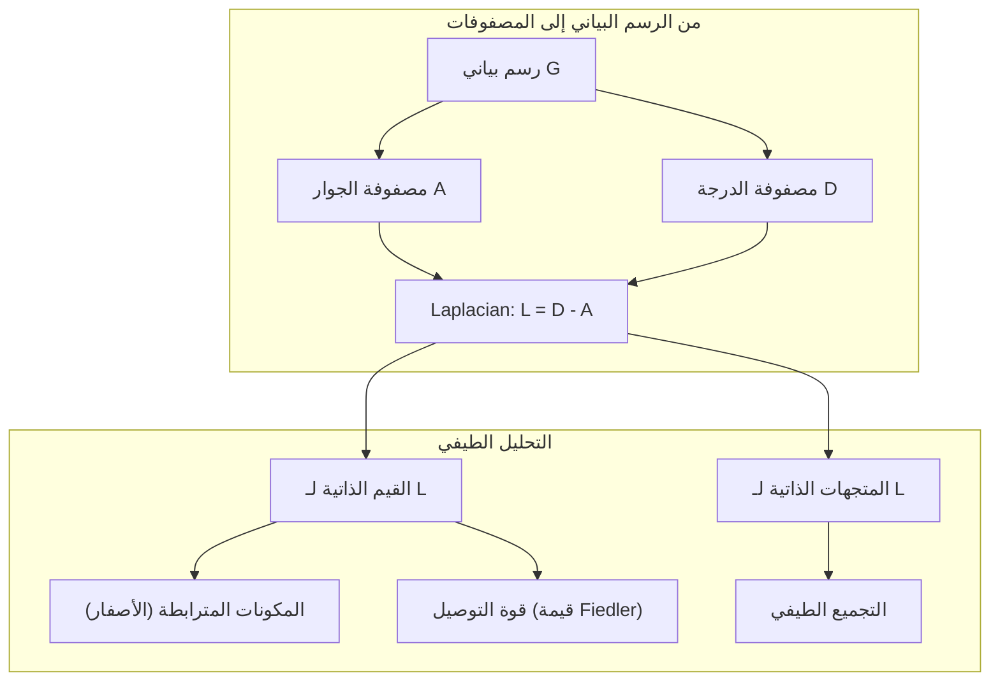

# نظرية الرسوم البيانية للتعلم الآلي

> الرسوم البيانية هي بنية البيانات للعلاقات. إذا كانت بياناتك تحتوي على روابط، فأنت تحتاج إلى نظرية الرسوم البيانية.

**النوع:** بناء (Build)  
**اللغة:** Python  
**المتطلبات المسبقة:** المرحلة 1، الدروس 01–03 (الجبر الخطي، المصفوفات)  
**الوقت المقدر:** ~90 دقيقة

---

## أهداف التعلم

- بناء كلاس للرسم البياني بتمثيلَي مصفوفة الجوار وقائمة الجوار، وتنفيذ خوارزميتَي BFS وDFS
- حساب Laplacian الرسم البياني واستخدام قيمه الذاتية لاكتشاف المكونات المترابطة وتجميع العقد
- تنفيذ جولة واحدة من Message Passing بأسلوب GNN كضرب مصفوفات جوار منظّمة
- تطبيق التجميع الطيفي (Spectral Clustering) لتقسيم الرسم البياني باستخدام متجه Fiedler

---

## لماذا نهتم بالرسوم البيانية؟

### المشكلة مع الجداول التقليدية

التعلم الآلي الكلاسيكي يعامل البيانات كجداول مسطّحة: كل صف مستقل، كل عمود ميزة. لكن العالم الحقيقي مليء بالعلاقات:

- **الشبكات الاجتماعية**: الصديق يشبه أصدقاءه أكثر من غيرهم
- **الجزيئات الكيميائية**: شكل ترابط الذرات هو ما يحدد خصائصها
- **شبكات المعرفة (Knowledge Graphs)**: "باريس" ترتبط بـ"فرنسا" ترتبط بـ"أوروبا"
- **شبكات الاحتيال**: المحتالون يتشكّلون في مجموعات ترابطية

فكّر في التنبؤ بمنتج يشتريه مستخدم على شبكة اجتماعية. تاريخ مشترياته مهم. لكن ما اشتراه أصدقاؤه **أكثر أهمية**. الاتصالات تحمل إشارة لا يستطيع الجدول التقليدي التقاطها.

**شبكات GNN (Graph Neural Networks)** هي أسرع منطقة نمواً في التعلم العميق. تُحرّك اكتشاف الأدوية، التوصيات الاجتماعية، كشف الاحتيال، والاستدلال على رسوم المعرفة. كل GNN يقوم على أساس واحد: نظرية الرسوم البيانية.

---

## المفاهيم الأساسية

### 1. تعريف الرسم البياني رياضياً

$$G = (V, E)$$

حيث:
- $V$ = مجموعة الرؤوس (العقد / Nodes)
- $E \subseteq V \times V$ = مجموعة الأضلاع (الحواف / Edges)

**مثال**: رسم بياني بثلاث عقد:

```
V = {0, 1, 2}
E = {(0,1), (1,2), (0,2)}    ← مثلث!
```

### أنواع الرسوم البيانية

| النوع | الوصف | مثال |
|-------|-------|-------|
| غير موجّه، غير موزون | الأضلاع ثنائية الاتجاه بدون وزن | شبكة صداقة فيسبوك |
| موجّه، غير موزون | الأضلاع أحادية الاتجاه | متابعات تويتر |
| غير موجّه، موزون | وزن يمثل قوة الربط أو المسافة | خريطة طرق (المسافات) |
| موجّه، موزون | اتجاه + وزن | درجات PageRank لصفحات الويب |

---

### 2. مصفوفة الجوار (Adjacency Matrix)

هي التمثيل الجوهري للرسم البياني. لرسم بياني بـ $n$ عقدة:

$$A_{ij} = \begin{cases} 1 & \text{إذا وُجد ضلع من العقدة } i \text{ إلى } j \\ 0 & \text{خلاف ذلك} \end{cases}$$

**مثال — المثلث** (العقد: 0، 1، 2):

$$A = \begin{pmatrix} 0 & 1 & 1 \\ 1 & 0 & 1 \\ 1 & 1 & 0 \end{pmatrix}$$

لاحظ: المصفوفة **متماثلة** (A = Aᵀ) لأن الرسم البياني غير موجّه — إذا كان هناك ضلع من 0 إلى 1، فهناك ضلع من 1 إلى 0.

**قراءة قوة في مصفوفة الجوار**: العنصر $(A^k)_{ij}$ يساوي عدد المسارات بالضبط من طول $k$ بين العقدتين $i$ و $j$. أي أن ضرب المصفوفات مرات عديدة يكشف البنية العميقة للرسم البياني!

---

### 3. مصفوفة الدرجة (Degree Matrix)

درجة العقدة = عدد الأضلاع المتصلة بها.

$$D_{ii} = \deg(i) = \sum_j A_{ij}$$

$$D = \text{diag}(d_0, d_1, \ldots, d_{n-1})$$

**مثال — المثلث**: كل عقدة تتصل بعقدتين أخريين، إذن درجة كل عقدة = 2:

$$D = \begin{pmatrix} 2 & 0 & 0 \\ 0 & 2 & 0 \\ 0 & 0 & 2 \end{pmatrix}$$

الدرجة تقيس **أهمية العقدة** (Hub nodes): عقدة بدرجة عالية = مركز الشبكة.

---

## خوارزميات الاستعراض

### 4. البحث بالعرض أولاً BFS (Breadth-First Search)

**الفكرة**: استعرض كل الجيران أولاً، ثم جيران الجيران. يستخدم **طابور Queue (FIFO)**.

**لماذا؟** لأن BFS يضمن أنك تصل لكل عقدة بأقصر مسار ممكن.

**مثال خطوة بخطوة** على رسم بياني بالعقد {0,1,2,3}:
```
Edges: 0-1, 0-2, 1-3, 2-3

ابدأ من 0:
  زر 0، الطابور: [1, 2]
  زر 1 (أقرب)، الطابور: [2, 3]
  زر 2، الطابور: [3]
  زر 3، الطابور: []
  انتهى!
```

المسافة من 0 إلى كل عقدة = مستوى BFS الذي اكتُشفت فيه. هذا هو المبدأ خلف حسابات **"درجات الفصل"** في الشبكات الاجتماعية.

---

### 5. البحث بالعمق أولاً DFS (Depth-First Search)

**الفكرة**: اذهب بأعمق ما يمكن قبل التراجع. يستخدم **مكدس Stack (LIFO)** أو العودية.

```
ابدأ من 0:
  زر 0، المكدس: [1, 2]
  زر 2 (من المكدس)، المكدس: [1, 3]
  زر 3، المكدس: [1]
  زر 1، المكدس: []
  انتهى!
```

**استخدامات DFS:**
- اكتشاف المكونات المترابطة (ابدأ DFS من كل عقدة لم تُزَر)
- كشف الدورات (أضلاع الرجوع في شجرة DFS)
- الترتيب الطبولوجي (عكس ترتيب انتهاء DFS)

| الخوارزمية | هيكل البيانات | تجد | حالة الاستخدام |
|------------|--------------|-----|----------------|
| BFS | طابور Queue | أقصر المسارات | المسافة في الشبكات الاجتماعية |
| DFS | مكدس Stack | مكونات، دورات | التوصيل، الترتيب الطبولوجي |

---

## Laplacian الرسم البياني

### 6. تعريف Laplacian

$$L = D - A$$

هذه المعادلة البسيطة تخفي قوة هائلة. **إنها المصفوفة الأهم في نظرية الرسوم البيانية الطيفية.**

**مثال — المثلث:**

$$L = D - A = \begin{pmatrix} 2 & 0 & 0 \\ 0 & 2 & 0 \\ 0 & 0 & 2 \end{pmatrix} - \begin{pmatrix} 0 & 1 & 1 \\ 1 & 0 & 1 \\ 1 & 1 & 0 \end{pmatrix} = \begin{pmatrix} 2 & -1 & -1 \\ -1 & 2 & -1 \\ -1 & -1 & 2 \end{pmatrix}$$

### 7. الخصائص الرياضية الرائعة لـ Laplacian

**الخاصية 1: L شبه محددة موجبة (Positive Semi-definite)**

لأي متجه $\mathbf{x}$:

$$\mathbf{x}^T L \mathbf{x} = \sum_{(i,j) \in E} (x_i - x_j)^2 \geq 0$$

هذا يعني: **جميع القيم الذاتية لـ L هي ≥ 0**. لا توجد قيم سلبية.

**الخاصية 2: عدد القيم الذاتية الصفرية = عدد المكونات المترابطة**

- رسم بياني متصل → قيمة ذاتية صفرية واحدة بالضبط
- رسم بياني بـ 3 مكونات منفصلة → 3 قيم ذاتية صفرية

لماذا؟ لأن المتجه الثابت $\mathbf{1} = [1,1,\ldots,1]$ هو دائماً متجه ذاتي بقيمة 0 (لأن $L\mathbf{1} = \mathbf{0}$).

**الخاصية 3: قيمة Fiedler (ثاني أصغر قيمة ذاتية) تقيس التوصيل**

- قيمة Fiedler كبيرة → الرسم البياني متصل جيداً
- قيمة Fiedler صغيرة → يوجد **عنق زجاجة (bottleneck)** ضعيف

**الخاصية 4: متجه Fiedler يكشف أفضل تقسيم**

العقد ذات القيم الموجبة في متجه Fiedler → مجموعة 1  
العقد ذات القيم السلبية → مجموعة 2

هذا هو **التجميع الطيفي (Spectral Clustering)** في جوهره!

---

## التجميع الطيفي (Spectral Clustering)

### 8. كيف يعمل؟

**الخوارزمية:**
1. احسب $L = D - A$
2. أوجد $k$ أصغر قيم ذاتية ومتجهاتها الذاتية (تجاهل الأول الصفري للرسوم البيانية المترابطة)
3. استخدم هذه المتجهات كإحداثيات جديدة لكل عقدة
4. شغّل k-means على هذه الإحداثيات

**لماذا يعمل هذا؟**

المتجهات الذاتية لـ $L$ تشفّر "أكثر الدوال سلاسة" على الرسم البياني. العقد المترابطة جيداً تحصل على قيم متجه ذاتي متشابهة. العقد المفصولة بعنق زجاجة تحصل على قيم مختلفة. المتجهات الذاتية تفصل المجموعات طبيعياً.



---

## Message Passing في شبكات GNN

### 9. العملية الجوهرية

في كل جولة، كل عقدة تجمع رسائل جيرانها، تجمعها، وتحدّث حالتها:

$$h_v^{(k+1)} = \text{UPDATE}\left(h_v^{(k)},\ \text{AGGREGATE}\left(\{h_u^{(k)} : u \in \mathcal{N}(v)\}\right)\right)$$

في أبسط صورة:

$$h_v^{(k+1)} = \sigma\left(W \cdot \frac{1}{|\mathcal{N}(v)|}\sum_{u \in \mathcal{N}(v)} h_u^{(k)}\right)$$

### 10. Message Passing هو ضرب مصفوفات!

إذا كانت $H$ مصفوفة ميزات جميع العقد و $A$ مصفوفة الجوار:

$$H^{(k+1)} = \sigma\left(A_{\text{norm}} \cdot H^{(k)} \cdot W\right)$$

حيث $A_{\text{norm}}$ هي مصفوفة الجوار المعيّرة (كل صف مجموعه 1).

**مثال بسيط** (مثلث بميزة واحدة لكل عقدة):

```
العقدة 0: [1, 0]    (ميزة البداية)
العقدة 1: [0, 1]
العقدة 2: [1, 1]

بعد جولة message passing:
  العقدة 0: متوسط(1، 2) = [0.5, 1.0]
  العقدة 1: متوسط(0، 2) = [1.0, 0.5]
  العقدة 2: متوسط(0، 1) = [0.5, 0.5]
```

- جولة 1: كل عقدة ترى جيرانها المباشرين
- جولة 2: كل عقدة ترى جيران جيرانها
- k جولات: كل عقدة ترى محيطها على بُعد k خطوات

---

## شرح الكود سطراً بسطر

### الكود الكامل:

```python
# Graph Theory for Machine Learning
# Source: phases/01-math-foundations/21-graph-theory/docs/en.md
# Implements: Graph representations, BFS, DFS, Laplacian, spectral clustering, GNN message passing

import math
from collections import deque

class Graph:
    """
    تمثيل الرسم البياني بمصفوفة الجوار وقائمة الجوار
    """

    def __init__(self, num_nodes, directed=False):
        # num_nodes: عدد العقد في الرسم البياني
        # directed: هل الرسم البياني موجّه؟
        self.n = num_nodes
        self.directed = directed
        # قائمة الجوار: كل عقدة لها قائمة بجيرانها
        self.adj_list = [[] for _ in range(num_nodes)]
        # مصفوفة الجوار: n×n، تُهيَّأ بالأصفار
        self.adj_matrix = [[0] * num_nodes for _ in range(num_nodes)]

    def add_edge(self, u, v, weight=1):
        """إضافة ضلع بين عقدتين"""
        # أضف ضلعاً من u إلى v في قائمة الجوار
        self.adj_list[u].append((v, weight))
        # وفي مصفوفة الجوار
        self.adj_matrix[u][v] = weight

        # إذا كان الرسم غير موجّه، أضف الضلع في الاتجاه الآخر أيضاً
        if not self.directed:
            self.adj_list[v].append((u, weight))
            self.adj_matrix[v][u] = weight

    def degree(self, node):
        """
        درجة العقدة = عدد الجيران
        رياضياً: deg(v) = Σⱼ A[v][j]
        """
        return len(self.adj_list[node])

    def degree_matrix(self):
        """
        مصفوفة الدرجة D (قطرية)
        D[i][i] = درجة العقدة i
        """
        D = [[0] * self.n for _ in range(self.n)]
        for i in range(self.n):
            D[i][i] = self.degree(i)  # فقط على القطر
        return D

    def laplacian(self):
        """
        حساب Laplacian: L = D - A
        هذا يعني: L[i][i] = درجة i، و L[i][j] = -A[i][j]
        """
        D = self.degree_matrix()
        L = [[0] * self.n for _ in range(self.n)]
        for i in range(self.n):
            for j in range(self.n):
                # L = D - A
                # D[i][j] - A[i][j]
                L[i][j] = D[i][j] - self.adj_matrix[i][j]
        return L

    def bfs(self, start):
        """
        البحث بالعرض أولاً (Breadth-First Search)
        يضمن اكتشاف العقد بأقصر مسار من البداية
        """
        visited = [False] * self.n       # هل زُرنا هذه العقدة؟
        order = []                        # ترتيب الزيارات
        distances = [-1] * self.n        # المسافات من start

        queue = deque([start])           # طابور FIFO
        visited[start] = True
        distances[start] = 0

        while queue:
            node = queue.popleft()       # أخذ من مقدمة الطابور
            order.append(node)

            # فحص كل جار
            for neighbor, _ in self.adj_list[node]:
                if not visited[neighbor]:
                    visited[neighbor] = True
                    distances[neighbor] = distances[node] + 1  # المسافة = مسافة الأب + 1
                    queue.append(neighbor)

        return order, distances

    def dfs(self, start):
        """
        البحث بالعمق أولاً (Depth-First Search)
        يستخدم العودية (مكدس ضمني)
        """
        visited = [False] * self.n
        order = []

        def dfs_recursive(node):
            visited[node] = True
            order.append(node)
            for neighbor, _ in self.adj_list[node]:
                if not visited[neighbor]:
                    dfs_recursive(neighbor)   # ادخل أعمق

        dfs_recursive(start)
        return order

    def connected_components(self):
        """
        اكتشاف المكونات المترابطة باستخدام DFS
        كل مكون = مجموعة عقد يمكن الوصول بينها
        """
        visited = [False] * self.n
        components = []

        for node in range(self.n):
            if not visited[node]:
                # ابدأ DFS من هذه العقدة غير المزارة
                component = []
                stack = [node]
                while stack:
                    v = stack.pop()
                    if not visited[v]:
                        visited[v] = True
                        component.append(v)
                        for neighbor, _ in self.adj_list[v]:
                            if not visited[neighbor]:
                                stack.append(neighbor)
                components.append(component)

        return components
```

---

### شرح دوال Laplacian والتحليل الطيفي:

```python
def mat_mul(A, B):
    """
    ضرب مصفوفتين بدون مكتبات خارجية
    C[i][j] = Σk A[i][k] * B[k][j]
    """
    n = len(A)
    m = len(B[0])
    p = len(B)
    C = [[0.0] * m for _ in range(n)]
    for i in range(n):
        for j in range(m):
            for k in range(p):
                C[i][j] += A[i][k] * B[k][j]
    return C

def power_iteration(A, num_iterations=1000):
    """
    إيجاد أكبر قيمة ذاتية ومتجهها عبر تكرار القوة
    يبدأ بمتجه عشوائي ويضرب بالمصفوفة مراراً
    المتجه يتقارب نحو الاتجاه الذاتي الأكبر
    """
    n = len(A)
    # ابدأ بمتجه عشوائي
    v = [1.0 / math.sqrt(n)] * n

    for _ in range(num_iterations):
        # اضرب: Av
        Av = [sum(A[i][j] * v[j] for j in range(n)) for i in range(n)]
        # احسب القيمة الذاتية: λ = v^T * Av
        eigenvalue = sum(v[i] * Av[i] for i in range(n))
        # عيّر المتجه
        norm = math.sqrt(sum(x ** 2 for x in Av))
        if norm < 1e-12:
            break
        v = [x / norm for x in Av]

    return eigenvalue, v

def normalized_adjacency(adj_matrix):
    """
    مصفوفة الجوار المعيّرة لـ Message Passing في GNN
    A_norm[i][j] = A[i][j] / degree(i)
    (كل صف مجموعه 1 — يعطي كل جار وزناً متساوياً)
    """
    n = len(adj_matrix)
    degrees = [sum(row) for row in adj_matrix]  # درجة كل عقدة
    A_norm = [[0.0] * n for _ in range(n)]
    for i in range(n):
        if degrees[i] > 0:
            for j in range(n):
                # قسّم كل عنصر في الصف على درجة العقدة
                A_norm[i][j] = adj_matrix[i][j] / degrees[i]
    return A_norm

def message_passing(adj_matrix, node_features, num_rounds=1):
    """
    تنفيذ Message Passing بأسلوب GNN
    رياضياً: H^(k+1) = A_norm × H^(k)
    (بدون وزن W وتفعيل σ للتبسيط)

    adj_matrix: مصفوفة الجوار n×n
    node_features: مصفوفة n×f (f = عدد الميزات)
    num_rounds: عدد جولات التمرير
    """
    A_norm = normalized_adjacency(adj_matrix)  # عيّر مصفوفة الجوار
    H = node_features  # حالة العقد الابتدائية

    for round_num in range(num_rounds):
        # H_new = A_norm × H
        # كل صف في H_new = متوسط ميزات الجيران
        H_new = mat_mul(A_norm, H)
        H = H_new

    return H
```

---

### مثال شامل: تحليل رسم بياني اجتماعي

```python
def demo_social_network():
    """
    مثال: شبكة اجتماعية صغيرة
    العقد: أليس(0)، بوب(1)، تشارلي(2)، ديف(3)، إيف(4)
    الأضلاع: 0-1، 0-2، 1-2، 3-4  (مجموعتان!)
    """
    g = Graph(5)
    g.add_edge(0, 1)
    g.add_edge(0, 2)
    g.add_edge(1, 2)   # مثلث: 0،1،2 متصلون ببعض
    g.add_edge(3, 4)   # مكوّن منفصل: 3 و 4

    # اكتشف المكونات
    components = g.connected_components()
    print("المكونات المترابطة:", components)
    # Output: [[0, 2, 1], [3, 4]]

    # احسب Laplacian
    L = g.laplacian()
    # عقد 0،1،2 ستعطي قيم ذاتية تشمل صفراً واحداً
    # عقد 3،4 منفصلة → صفر إضافي

    # Message passing: أعط كل عقدة ميزات ابتدائية
    features = [
        [1.0, 0.0],    # أليس
        [0.0, 1.0],    # بوب
        [1.0, 1.0],    # تشارلي
        [0.5, 0.5],    # ديف
        [0.0, 0.5],    # إيف
    ]
    H_after = message_passing(g.adj_matrix, features, num_rounds=1)
    print("\nبعد جولة Message Passing واحدة:")
    for i, h in enumerate(H_after):
        print(f"  العقدة {i}: {[round(x, 3) for x in h]}")

    return g, L, H_after

if __name__ == "__main__":
    demo_social_network()
```

---

## تطبيقات في التعلم الآلي

| المفهوم | تطبيق ML | المبدأ |
|---------|----------|---------|
| BFS/المسافة | التوصيات في الشبكات الاجتماعية | "أصدقاء أصدقاءك" |
| القيم الذاتية لـ Laplacian | التجميع الطيفي | المكونات المترابطة = أصفار |
| Message Passing | GNN (GraphSAGE, GCN) | تجميع ميزات الجيران |
| مصفوفة الجوار | اكتشاف الاحتيال | الأنماط في بنية الشبكة |
| متجه Fiedler | تقسيم الشبكات | التجميع الأمثل |
| PageRank | ترتيب نتائج البحث | المتجه الذاتي لمصفوفة الانتقال |

---

## التجميع الطيفي خطوة بخطوة

```python
def spectral_clustering(adj_matrix, k=2):
    """
    تقسيم الرسم البياني إلى k مجموعات
    باستخدام المتجهات الذاتية لـ Laplacian
    """
    n = len(adj_matrix)

    # 1. احسب Laplacian
    degrees = [sum(row) for row in adj_matrix]
    L = [[0.0] * n for _ in range(n)]
    for i in range(n):
        L[i][i] = degrees[i]
        for j in range(n):
            if adj_matrix[i][j]:
                L[i][j] -= adj_matrix[i][j]

    # 2. أوجد أصغر k قيم ذاتية غير صفرية
    # (في التطبيق الكامل: استخدم QR algorithm أو numpy)
    # هنا: تحليل مبسط للتوضيح
    eigenvalue, fiedler_vector = power_iteration(
        # L + shift لتحويل أصغر قيمة ذاتية لأكبر
        [[L[i][j] + (max(degrees) + 1) * (1 if i == j else 0) for j in range(n)] for i in range(n)]
    )

    # 3. قسّم بناءً على إشارة متجه Fiedler
    labels = [0 if fiedler_vector[i] >= 0 else 1 for i in range(n)]

    return labels, fiedler_vector
```

**مثال توضيحي**: رسم بياني بمجموعتين واضحتين:

```
المجموعة 1: {0, 1, 2} ← متصلون ببعض كثيراً
المجموعة 2: {3, 4, 5} ← متصلون ببعض كثيراً
الضلع الضعيف: 2-3 ← ربط خفيف بين المجموعتين

متجه Fiedler: [+0.4, +0.4, +0.2, -0.2, -0.4, -0.4]
                ↑ مجموعة 1            ↑ مجموعة 2
```

---

## مقارنة تمثيلَي الرسم البياني

| التمثيل | المساحة | إضافة ضلع | التحقق من ضلع | استعراض الجيران |
|---------|---------|-----------|---------------|-----------------|
| مصفوفة الجوار | $O(n^2)$ | $O(1)$ | $O(1)$ | $O(n)$ |
| قائمة الجوار | $O(n + m)$ | $O(1)$ | $O(\deg)$ | $O(\deg)$ |

- **مصفوفة الجوار**: أفضل للرسوم البيانية الكثيفة (كثير من الأضلاع)، وعمليات الجبر الخطي
- **قائمة الجوار**: أفضل للرسوم البيانية المتفرقة (قليل من الأضلاع)، ومعظم الشبكات الحقيقية

---

## نقطة تمييزية مهمة: PageRank

PageRank (الذي يحرك Google) هو متجه ذاتي! تحديداً:

$$\mathbf{r} = M \mathbf{r}$$

حيث $M$ هي مصفوفة انتقال احتمالية. المتجه الذاتي لـ $M$ بقيمة ذاتية 1 هو توزيع PageRank.

الأهمية الجوهرية: **الجبر الخطي وبنية الرسوم البيانية مترابطان بعمق**.

---

## تمارين

### تمرين 1: بناء رسم بياني وتحليله

```python
# أنشئ رسماً بيانياً يمثل بنية طبقات شبكة عصبية:
# طبقة 0: عقدتان (0، 1)
# طبقة 1: عقدتان (2، 3)
# كل عقدة في طبقة 0 متصلة بكل عقدة في طبقة 1

g = Graph(4, directed=True)
g.add_edge(0, 2)
g.add_edge(0, 3)
g.add_edge(1, 2)
g.add_edge(1, 3)

# ما هي درجات كل عقدة؟
# ما هو مصفوفة الجوار؟
# هل يمكن تمثيل هذا كضرب مصفوفات للـ Forward Pass؟
```

### تمرين 2: كشف المجموعات بـ Laplacian

```python
# رسم بياني بمجموعتين:
g2 = Graph(6)
# المجموعة 1: مثلث
g2.add_edge(0, 1)
g2.add_edge(1, 2)
g2.add_edge(0, 2)
# المجموعة 2: مثلث
g2.add_edge(3, 4)
g2.add_edge(4, 5)
g2.add_edge(3, 5)
# ضلع ضعيف بين المجموعتين
g2.add_edge(2, 3)

L = g2.laplacian()
# حلّل: كم عدد الأصفار التقريبية في القيم الذاتية؟
# ما هي إشارات متجه Fiedler؟
```

---

## أسئلة المراجعة

**السؤال 1 (ما قبل):** ما هو رسم بياني (Graph) في نظرية الرسوم البيانية؟  
**الجواب:** مجموعة من العقد (V) مع مجموعة أضلاع (E) تربط بين العقد. رياضياً: $G = (V, E)$.

**السؤال 2 (تحقق):** ما الفرق بين BFS وDFS في إيجاد المسارات؟  
**الجواب:** BFS يجد أقصر مسار (بالعدد من الأضلاع) لأنه يستعرض بالعرض أولاً. DFS قد لا يجد الأقصر.

**السؤال 3 (تحقق):** لماذا عدد القيم الذاتية الصفرية لـ Laplacian يساوي عدد المكونات المترابطة؟  
**الجواب:** لأن $\mathbf{x}^T L \mathbf{x} = \sum_{(i,j)\in E}(x_i-x_j)^2 = 0$ يعني $x_i = x_j$ لكل ضلع، أي المتجه ثابت على كل مكوّن. كل مكوّن يعطي متجهاً ثابتاً مستقلاً.

**السؤال 4 (تحقق):** ما هو Message Passing رياضياً؟  
**الجواب:** $H^{(k+1)} = A_{\text{norm}} \cdot H^{(k)} \cdot W$ — ضرب مصفوفات يجمّع ميزات الجيران لكل عقدة.

**السؤال 5 (بعد):** لماذا التجميع الطيفي يعمل على رسوم بيانية غير محدبة؟  
**الجواب:** لأنه لا يعتمد على المسافة الإقليدية، بل على بنية التوصيل. يمكنه كشف مجموعات ذات أشكال غير منتظمة تماماً.

**السؤال 6 (بعد):** لماذا k جولات من Message Passing تعطي معلومات من نطاق k خطوات؟  
**الجواب:** في كل جولة، كل عقدة تسمع من جيرانها المباشرين. بعد k جولات، المعلومة تنتشر عبر k خطوات — كل عقدة "ترى" بيئتها على بعد k خطوات.

---

## خلاصة المفاهيم

```
الرسم البياني G = (V, E)
        ↓
مصفوفة الجوار A + مصفوفة الدرجة D
        ↓
Laplacian: L = D - A
        ↓
تحليل طيفي: قيم ذاتية + متجهات ذاتية
        ↓
  ┌─────────────────────────────┐
  │ أصفار: المكونات المترابطة  │
  │ Fiedler: أفضل تقسيم        │
  │ Message Passing: GNN core  │
  └─────────────────────────────┘
```

**الصلة بالـ AI الحديث**: كل نموذج GNN (GraphSAGE, GAT, GCN) يعيد بناء هذه العمليات الأساسية بطبقات مكدّسة وأوزان قابلة للتعلم. فهم هذا الدرس يعني فهم ما يحدث داخل أقوى نماذج AI في مجال الجزيئات والشبكات والمعرفة.
